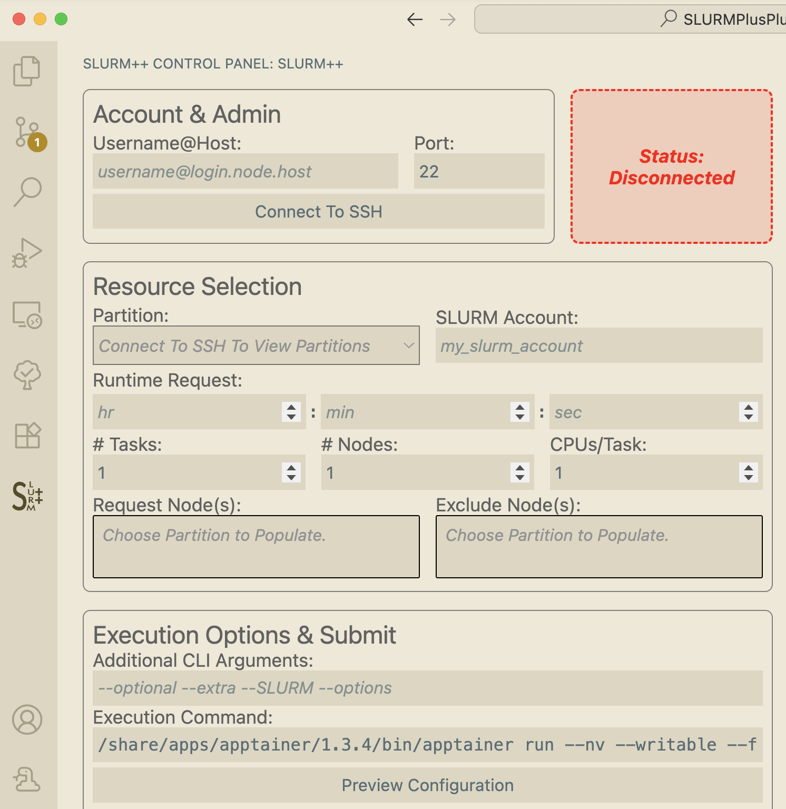

# Welcome to SLURM++!

## Background and Introduction

A. Several high performance computing (HPC) clusters (think, supercomputers) use [SLURM](https://slurm.schedmd.com/documentation.html), a suite of shell commands, to allow users to request computation resources in an equitable way.

B. Many developers also use [Visual Studio code](https://code.visualstudio.com) (VS Code), a flexible, extensible integrated development environment (IDE) for programming in a variety of languages.

C. Another challenge for developers is using HPC resources for development itself (not just running precompiled programs). This is important, especially in a machine learning/deep learning setting — an engineer may want to experiment and prototype large models that can only be run on HPC hardware. Development can be difficult in environments without `sudo`/`root`/`admin` privileges; often, developers require specific compilers, versions of packages, and hardware monitoring software. HPCs typically do not allow users to install such items.

**★ This extension, `SLURM++`, for VS Code, aims to address these issues through the following solutions:**

- Adds a graphical user interface for requesting and starting SLURM jobs directly inside VS Code without having to login (SSH) into the cluster login node and manually submit a command:

- Simulates a virtual machine with root access through [VS Code tunnelling](https://code.visualstudio.com/docs/remote/tunnels). This repository includes a script to install a docker container image "dev container". This runs on top of HPC hardware through `apptainer`, a docker-like engine that is common on HPC systems. Developers can use this, along with the `--fake-root` option, to simulate a virtual environment with elevated privleges.

## Schematic overview of the typical workflow

## Installation & typical usage workflow

1. Download and install VS Code (if not already completed): [download link here](https://code.visualstudio.com/download)
2. Complete the steps in the "First-Time Installation" section below to install the `SLURM++` dev container on your HPC cluster.
3. Install the `SLURM++` extension from the VS Code marketplace: [marketplace link here](https://marketplace.visualstudio.com/items?itemName=slurmtools.SLURMPlusPlus)
4. Open the `SLURM++` control panel in `User View Container: Focus on SLURM++ view`. The icon looks like this: . If it is not visible, open the command palette (Cmd+Shift+P on Mac, Ctrl+Shift+P on Windows) and search for `SLURM++: Focus on SLURM++ view`. You can optionally secondary-click and choose to keep it in the activity bar for easy access.
5. Connect to host by inputting username@host information. This extension has been testing with SSH key type authentication.
6. Input all desired SLURM parameters (e.g., number of nodes, time limit, etc.) in the GUI.
7. The "Execution Command" field should be prepopulated with `path/to/apptainer run --nv --writable --fakeroot tunneller-support-latest.sif /path/to/vscode/cli/executable tunnel`. This is based on using the apptainer structure (instructions in next section). You can modify this command if necessary. This command will start a bash shell inside the dev container on the compute node. You can also modify it to run a specific script or program.
8. Click "Preview Configuration" to see the generated SLURM script.
9. Click "Submit Job" to submit the job to the HPC cluster.
10. The `output` panel will display the node your job is running on, along with the job ID.
11. In the command palette, search for `Remote - Tunnels: Connect to Tunnel` and input the node address (e.g., `node123.cluster.edu`) to open a new VS Code window connected to the dev container inside the compute node. In a future release, this step will automatically open a new window for you.

## First-Time Installation (of dev container on HPC cluster):

### Prerequisites:
- `apptainer` installed on HPC cluster

### Docker Image Details:

The docker image used in this extension can be found on dockerhub: [https://hub.docker.com/repository/docker/benndrucker/tunneller-support/general](https://hub.docker.com/repository/docker/benndrucker/tunneller-support/general). It is built for `linux/amd64` and `linux/arm64` architectures. The image includes the following preinstalled software (summarized):

- VS Code CLI server
- Standard Linux utilities such as:
  - `wget`
  - `zsh`
  - `git`
  - `gcc` (and related compilation libraries)
  - `unzip`
- With the optional image `benndrucker/python-tunneller:0.0.1`, Python 3.13 is also installed, along with `pip`, `virtualenv`, and standard data science packages such as `scipy`, `pandas`, and `matplotlib`.

### Steps:
- Login to (SSH into) HPC "login" node.
- Load `apptainer` — typically by running `module load apptainer`.
- Download the installation script:
  - `curl -O "https://raw.githubusercontent.com/Ben-Drucker/slurm-gen-internal/refs/heads/main/build_and_nvidia_script.sh?token=GHSAT0AAAAAACTQF4TQOQRUCC5WY5RJVG6IZYRQF6A"`
  - Make it executable: `chmod +x build_and_nvidia_script.sh`
- Determine which docker image you want to use.
  - The default is `benndrucker/tunneller-support:latest`. For this image, run `./build_and_nvidia_script.sh tunneller-support:latest`. 
  - If you would like Python support, run `./build_and_nvidia_script.sh benndrucker/python-tunneller:latest`. (This image is larger and will take longer to download and build, but includes everything included in `tunneller-support:latest` plus Python 3.13 and standard data science packages.)
- Either command will do the following **automatically**:
  - Download the desired container.
  - Build the container to a `.sif` file
  - Install Nvidia drivers (See troubleshooting section if Nvidia drivers not found)

The dockerfiles used to build this image can be found in `extras/dockerfiles`. `tunnel_server.dockerfile` is the base image; `tunnel_support.dockerfile` and `tunnel_server.dockerfile` extends it to add Python support.

## Troubleshooting:

- Before continuing, ensure your version of VS Code is up to date.

| Problem                     | Solution                                                                                                                                                                                                                                              |
| --------------------------- | ----------------------------------------------------------------------------------------------------------------------------------------------------------------------------------------------------------------------------------------------------- |
| SSH won't connect           | • You may need to connect to a VPN and/or HTTPS proxy if your institution requires it   • An `id_rsa` ssh key is required (currently) for authentication. Ensure it is located in ~/.ssh.   • Ensure your computer has an ssh client installed. |
| `apptainer` not found       | • If you get this message (or something like it) you may need to modify the default command string in SLURM++ (I.e., if `apptainer` is located at a different path on your HPC cluster).                                                              |
| Job seems to quit instantly | • The container could not be run and the job exited. Check output log for the reason why.                                                                                                                                                             |
| CUDA support not working    | • During installation, if the Nvidia drivers were not found, they need to be installed manually using a command like `cp <path to drivers on host> <container.sif>/<driver paths>`.                                                                   |
| Other issues                | • This extension has not been tested on different HPC clusters with potentially different settings. If `stderr` differs, for example, when `srun` is called, the extension will not work.                                                             |

### Extension Development: To rebuild this extension manually on the command line (only tested on UNIX-like systems):
Run the shell commands:
- Update node/npm if necessary, for your operating system.
- `npm install`
- `npm install -g @vscode/vsce`
- `vsce package`
- `vsce publish` (if you are the publisher)